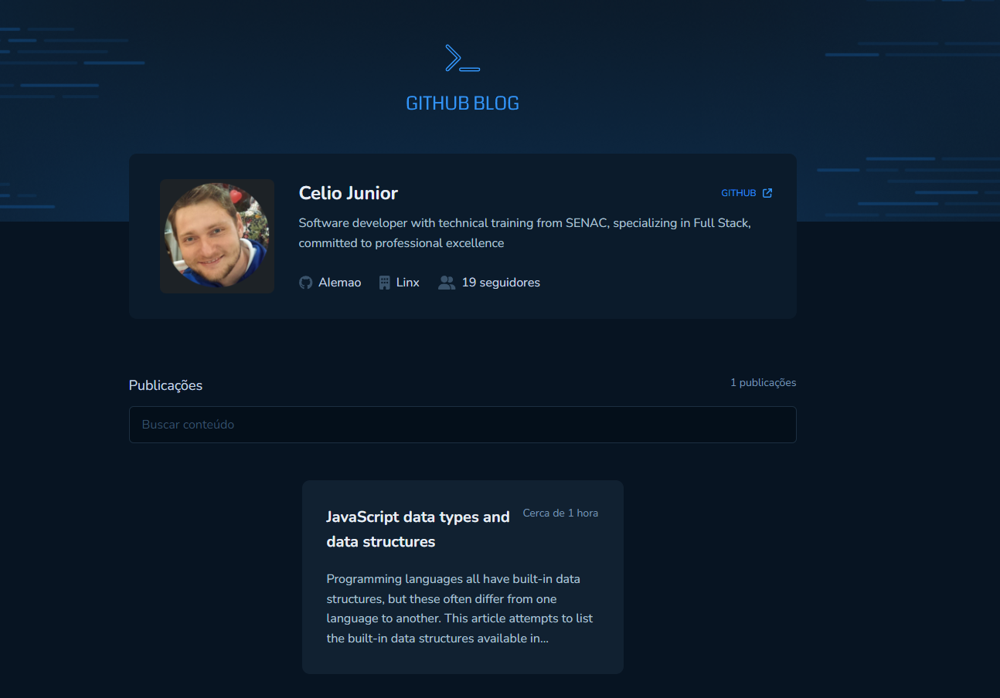

# GitHub Blog

Esta solução é baseada no curso Rocketseat - GitHub Desafio prático. 

## Índice

- [Visão geral](#visão-geral)
   - [Captura de tela](#captura-de-tela)
   - [Link](#link)
- [Meu processo](#meu-processo)
   - [Construído com](#construído-com)
- [O que aprendi](#o-que-aprendi)
   - [Funcionalidades Implementadas](#funcionalidades-implementadas)
      - [Perfil do Usuário](#perfil-do-usuário)
      - [Listagem e Filtro de Issues](#listagem-e-filtro-de-issues)
      - [Página de Post Completo](#página-de-post-completo)
   - [Conceitos Aplicados](#conceitos-aplicados)
      - [Integração com API](#integração-com-api)
      - [Roteamento Dinâmico](#roteamento-dinâmico)
      - [Formulários Gerenciados](#formulários-gerenciados)
      - [Layout Responsivo](#layout-responsivo)
- [Autor](#autor)

# Visão geral

GitHub Blog -  uma aplicação que utiliza a API do GitHub para buscar e exibir as issues de um repositório, transformando-as em um blog

### Captura de tela
  

## Link

- Solution URL: [GitHub](https://github.com/AIemao/githubBlog)

## Meu processo

### Construído com

- [ReactJS](https://react.dev/)
- [Typescript](https://www.typescriptlang.org/)
- [React Router DOM](https://reactrouter.com/en/main)
- [Styled Components](https://styled-components.com/)
- [Phosphor Icons](https://phosphoricons.com/)
- [Date-Fns](https://www.npmjs.com/package/date-fns)
- [Fontawesome](https://www.npmjs.com/package/@fortawesome/react-fontawesome)

## O que aprendi

### Funcionalidades Implementadas

#### Perfil do Usuário:

 - Exibição do perfil do usuário do GitHub, incluindo imagem, número de seguidores e outras informações relevantes.

#### Listagem e Filtro de Issues:

 - Listagem de todas as issues do repositório, permitindo filtrar por diferentes critérios.
 - Resumo do conteúdo de cada issue para uma visualização rápida.

#### Página de Post Completo:

 - Criação de uma página dedicada para exibir o conteúdo completo de uma issue (post).
 - Utilização de rotas dinâmicas para personalizar a visualização com base no número da issue.

### Conceitos Aplicados

#### Integração com API:

 - Uso eficaz de Fetch/Axios para interagir com a API do GitHub.
 - Implementação de chamadas à [GitHub Users API](https://docs.github.com/pt/rest/users/users?apiVersion=2022-11-28#get-a-user), [GitHub Search API](https://docs.github.com/pt/rest/search?apiVersion=2022-11-28) e [GitHub Issues API](https://docs.github.com/pt/rest/issues/issues?apiVersion=2022-11-28#get-an-issue).
 - Consideração do limite de requisições da API do GitHub, com a opção de configurar uma chave privada para aumentar o limite.

#### Roteamento Dinâmico:

 - Aplicação de roteamento dinâmico com o [React Router](https://reactrouter.com/en/main), permitindo uma experiência de usuário fluida.

#### Formulários Gerenciados:

 - Utilização eficiente do [react-hook-form](https://react-hook-form.com/) para gerenciar formulários na aplicação.

#### Layout Responsivo:

 - Implementação do layout da aplicação conforme especificado no Figma, proporcionando uma experiência consistente em diferentes dispositivos.

## Autor

- Site - [Celio Junior](https://www.linkedin.com/in/celio-junior-152529193/)
